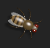

# DesktopFly для Linux

Этот проект — форк оригинала <a href="https://github.com/DenisSergeevitch/desktop-fly">DenisSergeevitch/desktop-fly</a>.
Исходная идея и ядро (модель нейронов FlyWire) принадлежат автору. Здесь сделана адаптация под Linux: Electron + three.js для рендеринга и Python (python-xlib) вместо нативного сенсоринга macOS/Windows.

DesktopFly — 3D-муха дрозофила на прозрачном оверлее рабочего стола Linux, приводимая
в движение симуляцией реальных нейронов коннектома FlyWire (FAFB v783).

23 210 позиций сомы нейронов (из 139 255 в FlyWire v783) отображают вращающееся окно мозга, окрашенное в цвет суперкласса (грубая группировка типов клеток FlyWire).
Схема из 668 нейронов с ~19 000 реальных синаптических связей (количество синапсов, подписанное предсказанием нейротрансмиттера) работает как симуляция утечки-интеграции и запуска (LIF) с частотой 1 кГц:
- LC4 (104) + LPLC2 (210) зрительные нейроны маятникового детектора;
- DNp01 / Giant Fiber (GF) (2) — управляющий нейрон;
- DNa01 + DNa02 (4) управляющие нейроны · DNp09 (2) ходьба вперед;
- DNg11 (6) уход · MDN (4) ходьба задом наперед («луноход»);
- DNp02/DNp04/DNp11 (6) нейронов ускользающего маневра (крыльевых);
- их 330 сильнейших партнеров, включая восходящие (проприоцептивные) и сенсорные (ветровые) нейроны.
Побег не заскриптован. Подход вашего курсора становится неясным входным сигналом для реальных ячеек LC4/LPLC2; муха взлетает только тогда, когда гигантское волокно действительно проходит через ее настоящие синапсы — около 1200 синапсов прямого торможения отталкивают назад, поэтому медленные подходы допустимы, а быстрые выпады вызывают бегство примерно за 4 мс, как и у настоящего животного.
Само тело процедурно (FlyWire — это мозговой коннектом, геометрии тела не существует), с походкой на треноге, видимым взмахом крыльев, полетом с масштабированием высоты, уходом за собой и позами для сна.


Мозг — это побайтовый порт `Sim.swift`; тело и поведение — побайтовый порт `FlyModel.swift`. 

<p align="center">
  
</p>

<p align="center"><sub>
3D муха дрозофила на рабочем столе Linux.
</sub></p>

<p align="center">
  
</p>

<p align="center"><sub>
Окно мозга мухи.
</sub></p>

## Почему Electron + Python

Приложение построено на Electron (WebGL через three.js) для рендеринга, а сенсоринг
рабочего стола под X11 реализован через небольшой Python-скрипт (`src/linux_env.py`),
который напрямую общается с сервером X через [python-xlib](https://pypi.org/project/python-Xlib/).

| macOS | Linux/X11 (этот порт) |
|---|---|
| SceneKit | three.js (WebGL) |
| AppKit `NSPanel`, borderless + `ignoresMouseEvents` | Electron `BrowserWindow`, `transparent` + `setIgnoreMouseEvents` |
| Меню `NSStatusItem` в строке меню | `Tray` |
| `CGWindowListCopyWindowInfo` | X11 через Python + python-xlib (`linux_env.py`) |
| Глобальный монитор мыши `NSEvent` | `XQueryPointer` на корневом окне (через Python) |
| Idle `CGEventSource` | `powerMonitor.getSystemIdleTime()` |
| Тепловое состояние `ProcessInfo.thermalState` | нагрузка CPU — температура CPU |
| Один `NSScreen`, прыжок через меню | один оверлей на весь виртуальный рабочий стол |

## Запуск

Запуск приложения
```sh
cd desktop-fly-linux
npm install
npm start              # значок в трее 🪰; есть меню с выходом из приложения
```

Запуск тестов сети
```sh
cd desktop-fly-linux
npm install
npm run simtest        # инварианты сети (ОБЯЗАТЕЛЬНО проходит после изменений sim)
npm run behaviortest   # 18 проверок «от начала до конца» sim -> тело
npm test               # оба набора
```

`DESKTOPFLY_DEBUG=1 npm start -- --disable-gpu` логирует террейд окон, геометрию
оверлея и консольный вывод рендерера в stderr.

Наборы тестов запускаются на голом Node — three.js строит граф сцены мухи
headlessly, поэтому поведение тестируется без GPU.

### Зависимости системы

```sh
sudo apt install python3-pip && pip install python-Xlib
```

`npm start -- --disable-gpu` рекомендуется под X11 — процесс GPU Electron v32 может упасть при
запуске в некоторых драйверах (см. [Известные ограничения](#известные-ограничения)), но производительность упадет.
Он влияет только на композитер; сама муха рендерится через three.js.

## Что ощущает муха

Всё — только опрос и не требует диалога разрешений. Муха узнаёт *когда* что-то
происходит, никогда *что*:

- **Курсор** — положение и скорость становятся стимулом приближения, разделяются
  между глазами по азимуту, подаётся на 314 нейронов LC4/LPLC2. Выпад приводит к
  DNp01 гигантскому волокну, и муха взлетает ~4 мс позже. Быстрое движение рядом —
  это воздушный толчок на сенсорном пути.
- **Клики** — глобальное нажатие кнопки мыши — это тап по субстрату мухи, стимулирующий
  сенсорные нейроны с силой, убывающей с расстоянием.
- **Окна** — верхние края реальных окон — это проходимые уступы; окно, появляющееся
  рядом с мухой, — это объект приближения. Читается только геометрия: пиксели под
  мухой никогда не семплируются.
- **Печать** — таймер простоя системы говорит, что устройство ввода было затронуто;
  если курсор не двигался и кнопка не нажималась, это была клавиатура. Ни одна клавиша
  никогда не опрашивается индивидуально.
- **Часы и нагрузка CPU** — кривая циркадной активности и темп эктотерма.

## Мульти-монитор

Оверлей охватывает объединение всех дисплеев, поэтому ходьба и полёт между мониторами —
это обычное движение, а не переключение режима. Дисплеи передаются в сцену как rects,
чтобы муха никогда не целилась в мёртвые углы непрямоугольной раскладки. «Send Fly to
Next Display» в меню трее подталкивает её туда по запросу.

## Известные ограничения

- Под X11 процесс GPU Electron v32 может не запуститься в некоторых драйверах
  (`GPU process isn't usable`, иногда краш). Запустите с `npm start -- --disable-gpu` —
  муха рендерится через three.js независимо.
- Сенсинг рабочего стола работает через Python + python-xlib. Без python3 или
  python-Xlib муха всё равно работает, но теряет уступы окон и тапы кликов (при запуске
  печатается предупреждение).
- Под X11 оверлеи не композитятся над **исключительным** fullscreen-приложениями;
  там муха скрыта. Borderless fullscreen в порядке.

## Расположение файлов

| файл | содержимое |
|---|---|
| `main.js` | Electron main: оверлей + окна мозга, трей, ощущения окружения |
| `preload.mjs` | единственный мост main↔renderer |
| `renderer/overlay.js` | `buildScene` + `Coordinator` из `main.swift` |
| `renderer/brain.js` | порт `BrainView.swift` |
| `src/sim.js` | порт `Sim.swift` (`LIFSim`, `SpikeBus`, `BrainSignals`) |
| `src/flymodel.js` | порт `FlyModel.swift` (геометрия тела + поведение) |
| `src/signals.js` | порт `SignalBuilder` |
| `src/linux_env.py` | ощущение X11 (окна/мышь) через python-xlib (вызывается из linuxX11.js) |
| `src/linuxX11.js` | мост окружения Linux — синхронно запускает linux_env.py |
| `src/environment.js` | кривая циркадной активности, темп нагрузки CPU |
| `src/data.js` | загрузка JSON только для Node (держит вне `sim.js` для renderer) |
| `test/` | порты `--simtest` и `--behaviortest` |

Данные из `../data/` — те же поставляемые `brain_points.json` и `circuit.json`,
по тем же условиям CC BY-NC 4.0.
